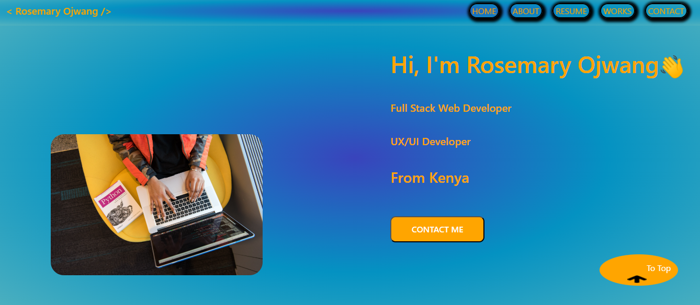

# Static Portfolio Website

**By Rosemary Ojwang**

*A website that showcases my coding work*

## Technologies Used
* HTML
* CSS
* JavaScript

## Description
*This is a website built to showcase my technical skills and web design skills.*

## Set-up/Installation Requirements
1. Clone this repository to your desktop.
2. Navigate to the top level of the directory.
3. Open index.html in your browser.

## License
[MIT](https://opensource.org/license/mit/)

_Copyright (c) 2022._ _**Rosemary Ojwang**_